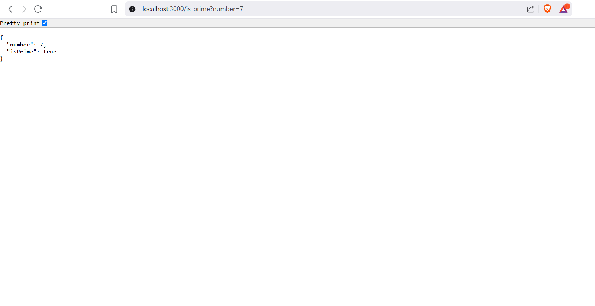

# Prime Number Checker API

A lightweight Express.js API to check whether a number is a prime.

-> How to Run Locally

```bash
git clone https://github.com/your-username/prime-check-api.git
cd prime-check-api
npm install
node index.js

## Usage:
Open your browser or Postman:
GET http://localhost:3000/is-prime?number=7

## Response:
{
  "number": 7,
  "isPrime": true
}

## Tech Stack:
Node.js
Express.js

## Features:
Clean modular code
Type and range validations
Returns informative JSON responses

## API Screenshot
Below is a screenshot of the API running locally:

